# Titanic Survival EDA Report

An in-depth exploratory analysis of the Titanic dataset using Python. This project investigates survival patterns based on features such as class, gender, age, fare, and family relationships.

---

## Objective

To explore and visualize the Titanic passenger dataset to identify key factors that influenced survival during the disaster.

---

## Tools Used

- Python (Google Colab)
- Pandas, Matplotlib, Seaborn
- Dataset from [Kaggle - Titanic Dataset](https://www.kaggle.com/datasets/sakshisatre/titanic-dataset)

---

## Key Explorations & Visual Insights

### 1. Missing Value Heatmap  
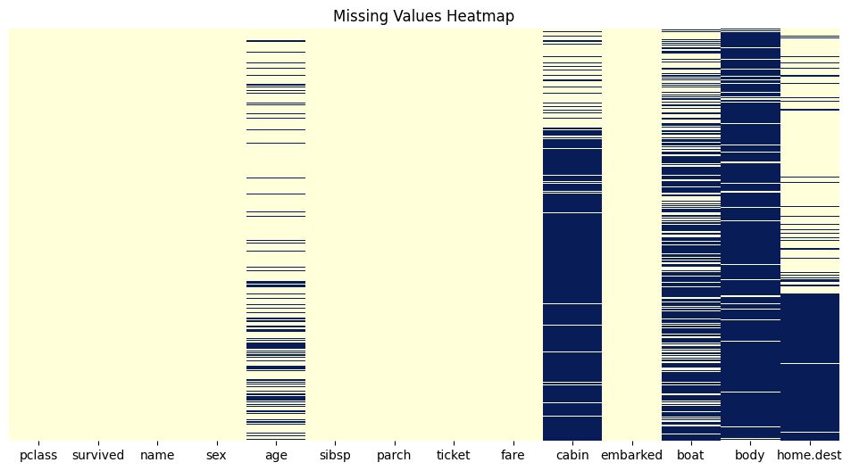  
**Observation:**  
- `age`, `cabin`, `boat`, and `body` columns had significant missing values.  
- `age` and `fare` were imputed using median; high-missing columns were dropped.

---

### 2. Gender Distribution  
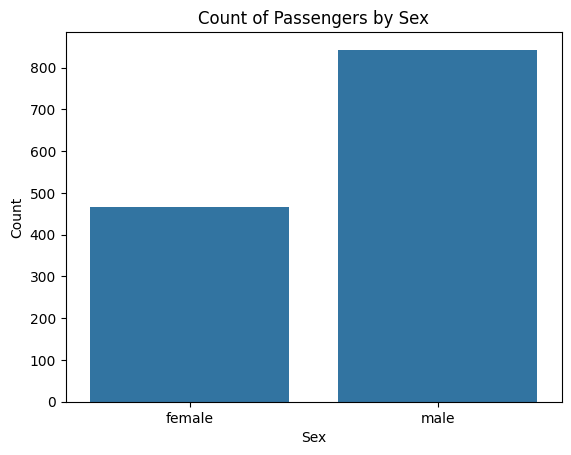  
**Insight:**  
~840 males and ~470 females. Titanic had significantly more male passengers.

---

### 3. Passenger Class  
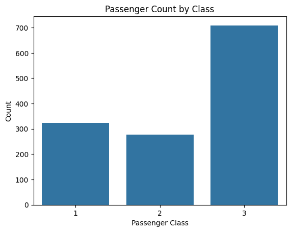  
**Insight:**  
~710 in 3rd class, ~280 in 2nd, ~320 in 1st — majority were lower-class passengers.

---

### 4. Port of Embarkation  
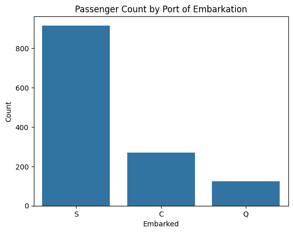  
**Insight:**  
Most passengers (~914) embarked from Southampton (‘S’).

---

### 5. Age Distribution  
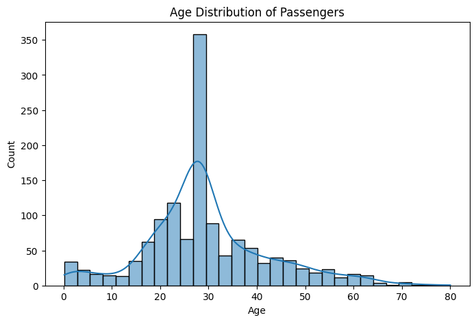  
**Insight:**  
Peak age group was 20–40 years. Median age was ~28 years.

---

### 6. Fare Distribution  
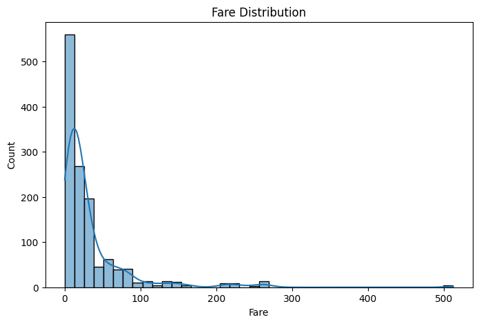  
**Insight:**  
Majority of fares were under £50. Fare data is right-skewed with some extreme outliers (max: £512).

---

### 7. Survival Count  
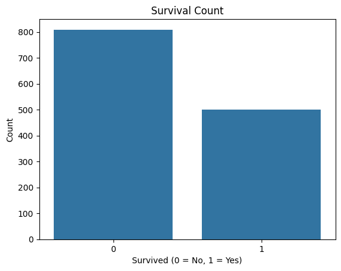  
**Insight:**  
38% survived, 62% did not. Data is imbalanced toward non-survivors.

---

### 8. Gender vs Survival  
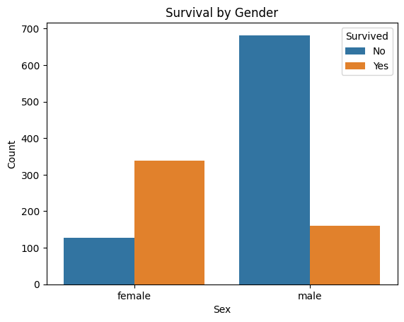  
**Insight:**  
- ~72% of females survived  
- ~21% of males survived  
Women had significantly higher survival rates.

---

### 9. Class vs Survival  
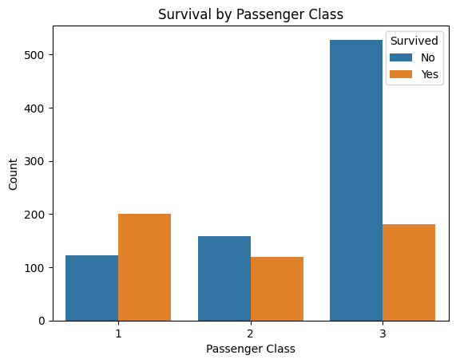  
**Insight:**  
- 1st class survival: ~62%  
- 2nd class: ~43%  
- 3rd class: ~26%  
Wealth and class greatly influenced survival.

---

### 10. Age vs Survival  
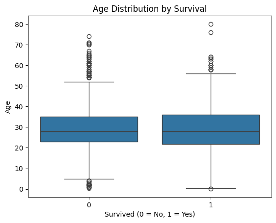  
**Insight:**  
Children under 15 had higher survival. Elderly had lowest.

---

### 11. Fare vs Survival  
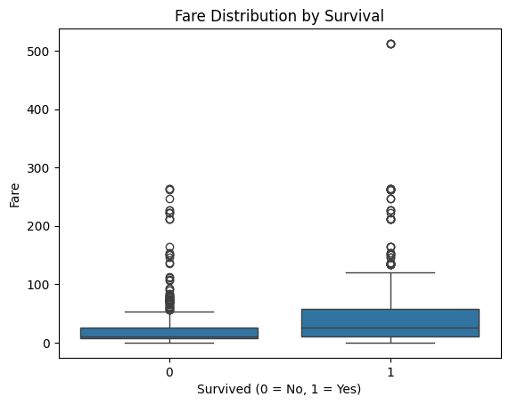  
**Insight:**  
Passengers who paid higher fares (mostly 1st class) were more likely to survive.

---

### 12. Correlation Heatmap  
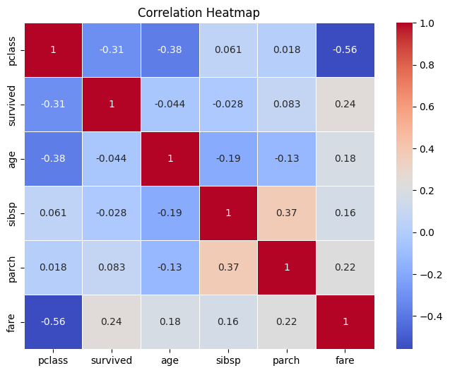  
**Top Correlations:**  
- Fare: +0.24  
- Pclass: –0.31  
- Age: –0.07  
Fare and class had the strongest influence on survival.

---

### 13. Pairplot (Survival Relationships)  
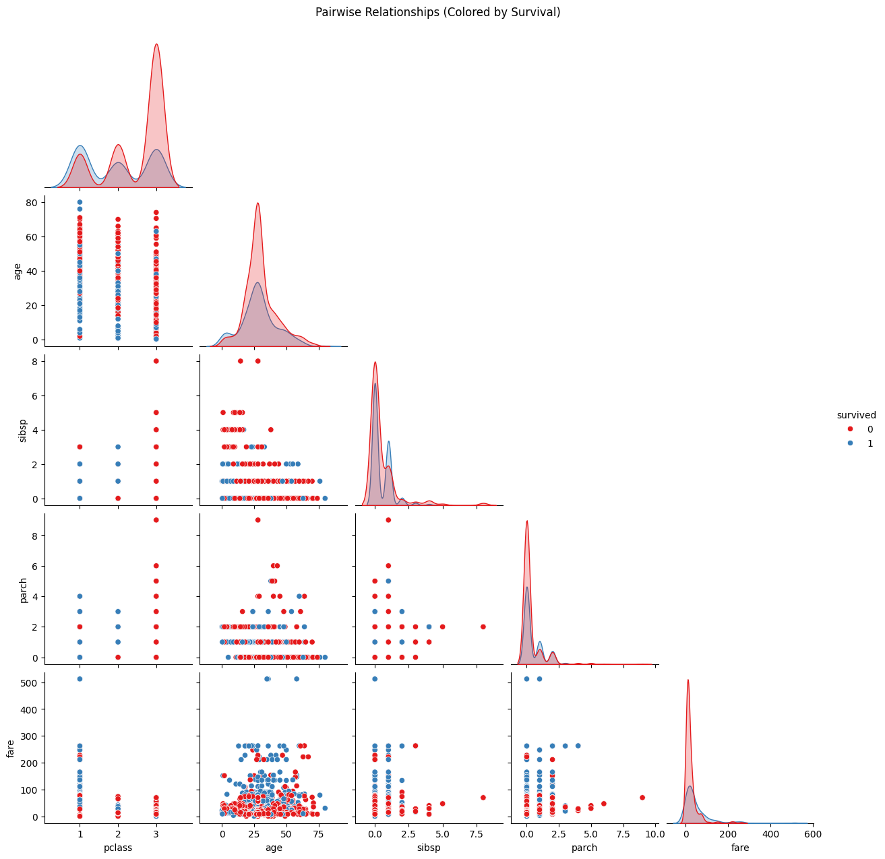  
**Insight Summary:**  
- Survivors clustered around high fare, 1st class, and younger ages.  
- Non-survivors mostly older, lower fare, and 3rd class.  
- Small families survived more than large ones.

---

## Conclusion

- **Women, children, and 1st-class passengers** had the best survival chances.  
- **Fare and class** are the most reliable predictors of survival.  
- **Larger families, males, and elderly in 3rd class** were most at risk.

---

> **Note**: All visuals are included in the notebook and the final PDF report.

